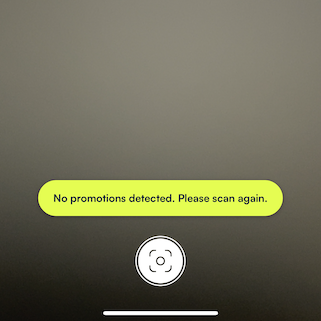
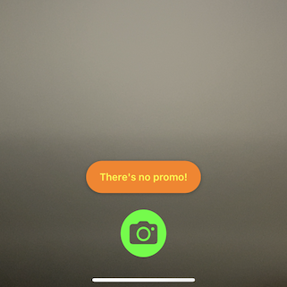

# **Product Recognition** SDK for iOS

The Product Recognition SDK lets you build a fantastic in-store experience in your iOS app. Effortlessly scan the products in grocery store and get all the needed data about them!


## Requirements

SDK package contains Product Recognition framework and sample apps which demonstrate framework integration. The framework can be deployed in **iOS 13.0 or later**.


## Installation

### CocoaPods

### Carthage

### Swift Package Manager

### Manually


## Sample apps

Under [Samples](Samples) directory, you can find a simple demo app that is using our SDK. Some options are used and presented. 

## Getting Started
### Set Up License Key for Authentication
```swift
func application(_ application: UIApplication, didFinishLaunchingWithOptions
                 launchOptions: [UIApplication.LaunchOptionsKey: Any]?) -> Bool {

  AuthManager.shared.loadAuthTokenForCurrentDevice(licenseKey: <license key string>)
  
  return true
}
```
### Add to Info.plist
| Key | Value |
| --- | --- |
| Privacy - Camera Usage Description | Camera access is needed to capture images of products |
### Usage
```swift
let singlePhotoVC = SinglePhotoVC()
singlePhotoVC.modalPresentationStyle = .fullScreen
self.present(singlePhotoVC, animated: true)
```
_Callback that returns the URL of the captured image saved locally._
```swift
singlePhotoVC.didCaptureImage = { url in
  // ...
}
```
_Callback that returns detected products with promo details and the URL of the captured image._
```swift
singlePhotoVC.didReceiveResults = { (products, imageURL) in
  // ...
}
```
_Read-only variable that returns the URL of the latest captured image._
```swift
let url = singlePhotoVC.capturedImageURL
```
_Function that deletes all the captured images saved locally in the 'Images' folder._
```swift
singlePhotoVC.clearAllCapturedImagesFromDisk(okTitle: nil, okMesssage: nil,
                                             failedTitle: nil, failedMessage: nil)
```

## Customizable UI
### Capture View
> Default || Custom

 
```swift
// When captureRegion is not set, the entire screen is the default capture region
singlePhotoVC.captureRegion = CGRect(x: 100, y: 100, width: 200, height: 600)
// Custom UI elements
singlePhotoVC.shutterButtonImage = UIImage(systemName: "camera.circle.fill",
                                           withConfiguration: UIImage.SymbolConfiguration(pointSize: 80))
singlePhotoVC.shutterButtonTint = UIColor.green
```
### Result View and Sub-views
```swift
var config = ResultViewConfiguration()
// Set configuration here
// ...
singlePhotoVC.resultViewConfiguration = config
```
#### No Promo Label
> _Momentarily displayed when no promo was detected._
```swift
config.noPromoConfiguration.contentBackgroundColor = UIColor.blue
config.noPromoConfiguration.textColor = UIColor.yellow
config.noPromoConfiguration.font = UIFont.italicSystemFont(ofSize: 20)
config.noPromoConfiguration.text = "There's no promotion. Please try again."
```
#### Promo Indicator
> _The icon placed on top of a detected product with promotion._
```swift
config.promoIndicatorConfiguration.image = UIImage(systemName: "tag.circle")
config.promoIndicatorConfiguration.contentBackgroundColor = UIColor.blue
config.promoIndicatorConfiguration.imageTintColor = UIColor.yellow
config.promoIndicatorConfiguration.pulseAnimationDuration = 0.5
config.promoIndicatorConfiguration.pulseTintColor = UIColor.red
config.promoIndicatorConfiguration.resizeAnimationDuration = 0.1
```
#### Promo Banner
> _Displayed when a promo indicator is selected._
```swift
config.promoBannerConfiguration.contentBackgroundColor = UIColor.lightGray
config.promoBannerConfiguration.photoContentMode = UIView.ContentMode.scaleToFill
config.promoBannerConfiguration.detailTextColor = UIColor.yellow
config.promoBannerConfiguration.detailFont = UIFont.monospacedSystemFont(ofSize: 11, weight: .thin)
config.promoBannerConfiguration.titleTextColor = UIColor.green
config.promoBannerConfiguration.titleFont = UIFont.italicSystemFont(ofSize: 18)
config.promoBannerConfiguration.highlightedBackgroundColor = UIColor.orange
config.promoBannerConfiguration.highlightedFont = UIFont.boldSystemFont(ofSize: 14)
config.promoBannerConfiguration.highlightedTextColor = UIColor.blue
config.promoBannerConfiguration.tagImage = UIImage(systemName: "tag.circle.fill")
config.promoBannerConfiguration.tagBackgroundColor = UIColor.systemPink
config.promoBannerConfiguration.tagTintColor = UIColor.green
```
#### Scan Again Button and Navigation Bar
> _Navigation bar at the bottom that contains the Scan Again button._
```swift
config.scanAgainConfiguration.navigationBarColor = UIColor.gray
config.scanAgainConfiguration.borderColor = UIColor.red
config.scanAgainConfiguration.borderWidth = 5
config.scanAgainConfiguration.borderGap = 2
config.scanAgainConfiguration.contentBackgroundColor = UIColor.orange
config.scanAgainConfiguration.hideBorder = false
config.scanAgainConfiguration.iconImage = UIImage(systemName: "viewfinder.circle")
config.scanAgainConfiguration.iconTintColor = UIColor.yellow
config.scanAgainConfiguration.text = "Try Scanning Again"
config.scanAgainConfiguration.textFont = UIFont.monospacedSystemFont(ofSize: 16, weight: .bold)
config.scanAgainConfiguration.textColor = UIColor.green
```
#### Promo List / Card
> _Displays summary of promotions when collapsed. Shows full list of promotions when expanded._
```swift
config.promoListConfiguration.cardBackgroundColor = UIColor.darkGray
config.promoListConfiguration.cardHandleBarColor = UIColor.white
config.promoListConfiguration.summaryTextColor = UIColor.green
config.promoListConfiguration.summaryFont = UIFont.monospacedSystemFont(ofSize: 16, weight: .bold)
config.promoListConfiguration.cellConfiguration.contentBackgroundColor = UIColor.gray
config.promoListConfiguration.cellConfiguration.detailFont = UIFont.monospacedSystemFont(ofSize: 12, weight: .thin)
config.promoListConfiguration.cellConfiguration.detailTextColor = UIColor.red
config.promoListConfiguration.cellConfiguration.highlightedBackgroundColor = UIColor.orange
config.promoListConfiguration.cellConfiguration.highlightedFont = UIFont.boldSystemFont(ofSize: 14)
config.promoListConfiguration.cellConfiguration.highlightedTextColor = UIColor.blue
config.promoListConfiguration.cellConfiguration.photoContentMode = UIView.ContentMode.scaleAspectFill
config.promoListConfiguration.cellConfiguration.tagImage = UIImage(systemName: "tag.circle.fill")
config.promoListConfiguration.cellConfiguration.tagBackgroundColor = UIColor.systemPink
config.promoListConfiguration.cellConfiguration.tagTintColor = UIColor.green
config.promoListConfiguration.cellConfiguration.titleTextColor = UIColor.green
config.promoListConfiguration.cellConfiguration.titleFont = UIFont.italicSystemFont(ofSize: 18)
```
#### Promo Details
> _Displayed when a promo banner is tapped or a row is selected from the promo list._
```swift
config.promoDetailsConfiguration.cardBackgroundColor = UIColor.black
config.promoDetailsConfiguration.detailBorderColor = UIColor.red
config.promoDetailsConfiguration.detailHeaderIcon = UIImage(named: "tag.circle")
config.promoDetailsConfiguration.detailHeaderIconTintColor = UIColor.green
config.promoDetailsConfiguration.detailHeaderFont = UIFont.monospacedSystemFont(ofSize: 14, weight: .bold)
config.promoDetailsConfiguration.detailHeaderText = "More Details..."
config.promoDetailsConfiguration.detailHeaderTextColor = UIColor.blue
config.promoDetailsConfiguration.mainDetailFont = UIFont.monospacedSystemFont(ofSize: 18, weight: .thin)
config.promoDetailsConfiguration.mainDetailTextColor = UIColor.orange
config.promoDetailsConfiguration.limitationDetailFont = UIFont.monospacedSystemFont(ofSize: 12, weight: .medium)
config.promoDetailsConfiguration.limitationDetailTextColor = UIColor.yellow
config.promoDetailsConfiguration.dismissButtonImage = UIImage(systemName: "xmark.circle")
config.promoDetailsConfiguration.dismissButtonSize = CGSize(width: 40, height: 40)
config.promoDetailsConfiguration.dismissButtonTintColor = UIColor.purple
config.promoDetailsConfiguration.highlightedBackgroundColor = UIColor.orange
config.promoDetailsConfiguration.highlightedFont = UIFont.boldSystemFont(ofSize: 14)
config.promoDetailsConfiguration.highlightedTextColor = UIColor.blue
config.promoDetailsConfiguration.photoContentMode = UIView.ContentMode.scaleAspectFill
config.promoDetailsConfiguration.tagImage = UIImage(systemName: "tag.circle.fill")
config.promoDetailsConfiguration.tagBackgroundColor = UIColor.systemPink
config.promoDetailsConfiguration.tagTintColor = UIColor.green
config.promoDetailsConfiguration.titleTextColor = UIColor.green
config.promoDetailsConfiguration.titleFont = UIFont.italicSystemFont(ofSize: 18)
```
