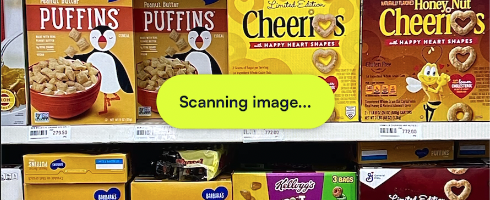
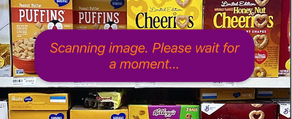
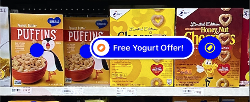
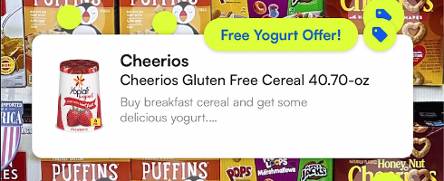
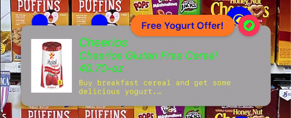
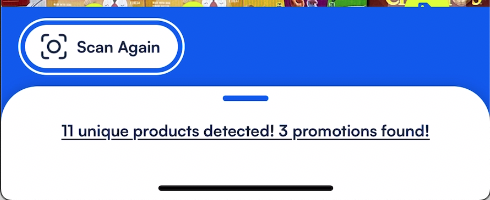
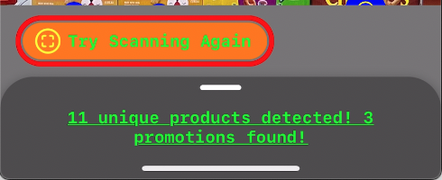
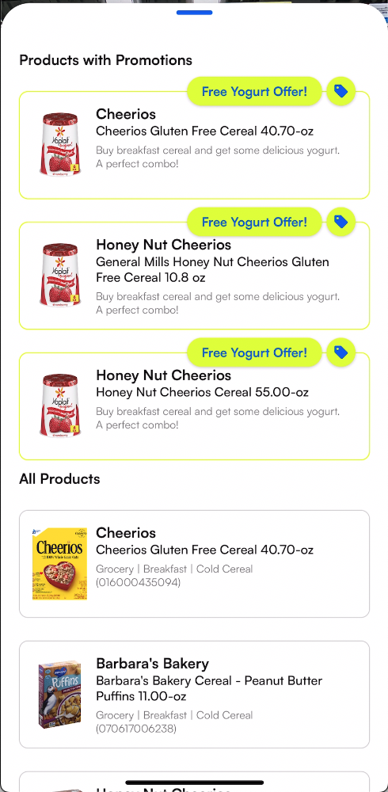
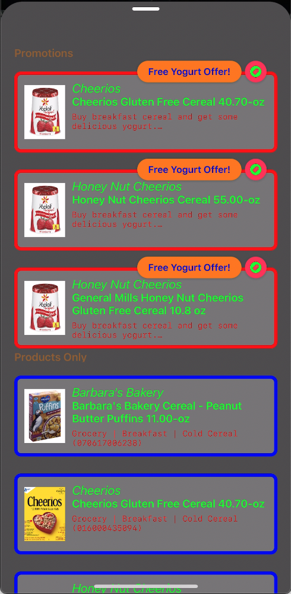

# **Product Recognition** SDK for iOS

The Product Recognition SDK lets you build a fantastic in-store experience in your iOS app. Effortlessly scan the products in grocery store and get all the needed data about them!


## Requirements

SDK package contains Product Recognition framework and sample apps which demonstrate framework integration. The framework can be deployed in **iOS 13.0 or later**.


## Installation


### CocoaPods
[CocoaPods](https://cocoapods.org) is a dependency manager for Swift and Objective-C Cocoa projects. For usage and installation instructions, visit their website. Here is a sample barebones `Podfile` which imports the `ProductRecognition` pod:
```shell
#You must include this additional source as the BlinkEReceipt pod is hosted in a private spec repository
source 'https://github.com/BlinkReceipt/PodSpecRepo.git'
source 'https://cdn.cocoapods.org/'

platform :ios, '13.0'

target 'YourTarget' do
  use_frameworks!

  pod 'ProductRecognition'
end
```
After editing your `Podfile`, run `pod install` and then make sure to open the `.xcworkspace` file rather than the `.xcodeproj`.

### Carthage
[Carthage](https://github.com/Carthage/Carthage) is a decentralized dependency manager that builds your dependencies and provides you with binary frameworks, but you retain full control over your project structure and setup. Carthage does not automatically modify your project files or your build settings.

To integrate the Product Recognition SDK into your Xcode project using Carthage, specify it in your `Cartfile`:
```shell
binary "https://raw.githubusercontent.com/BlinkReceipt/product-recognition-sdk-ios/main/ProductRecognition.json" ~> 1.0
```
After editing your `Cartfile`, run `carthage update --use-xcframeworks` and then add `ProductRecognition.xcframework` to your project. It should be located at `~/Carthage/Build/`.

### Swift Package Manager
The [Swift Package Manager](https://www.swift.org/package-manager/) is a tool for managing the distribution of Swift code. It’s integrated with the Swift build system to automate the process of downloading, compiling, and linking dependencies.

1. In Xcode, install the Product Recognition SDK by navigating to ***File > Add Packages***
2. Go to `Search or Enter Package URL` at the top-right search bar of the window that appears, then type:
```swift
https://github.com/BlinkReceipt/product-recognition-sdk-ios.git
```
3. Select `Up to Next Major Version` on the ***"Dependency Rule"*** and type `1.0.0`
4. Click ***Add Package***

### Manually
#### Embedded Framework
If you prefer not to use any dependency managers, you can integrate the Product Recognition SDK into your project manually.
1. If you haven't initialized your project as a git repository, open __Terminal__ and go to the root of your project directory. Run this command:
```shell
$ git init
```
2. Add ProductRecognition as a [submodule](https://git-scm.com/docs/git-submodule) by running the command:
```shell
$ git submodule add https://github.com/BlinkReceipt/product-recognition-sdk-ios.git
```
3. Open the new `product-recognition-sdk-ios` folder and drag the `ProductRecognition.xcframework` into the Project Navigator of your application's Xcode project.
4. Select the `ProductRecognition.xcframework` in the Project Navigator and verify the deployment target matches that of your application target.
5. Next, select your application project in the Project Navigator (blue project icon) to navigate to the target configuration window and select the application target under the ***"Targets"*** heading in the sidebar.
6. In the tab bar at the top of that window, open the ***"General"*** panel and click on the `+` button under the ***"Frameworks, Libraries, and Embedded Content"*** section.
7. On the window that shows, search for "ProductRecognition". Select `ProductRecognition.xcframework` from the list then click ***Add***.
8. On the table's ***"Embed"*** column, make sure that `Embed & Sign` is selected.

| Name | Embed |
| --- | --- |
| ProductRecognition.xcframework | Embed & Sign |
9. Now you're good to go!

## Sample apps

Under [Samples](Samples) directory, you can find a simple demo app that is using our SDK. Some options are used and presented. 

## Getting Started
### Set Up License Key for Authentication
> _Use the `license key` associated with your app's `Bundle Identifier`._
```swift
func application(_ application: UIApplication, didFinishLaunchingWithOptions
                 launchOptions: [UIApplication.LaunchOptionsKey: Any]?) -> Bool {

  AuthManager.shared.loadAuthTokenForCurrentDevice(licenseKey: <license key string>)
  
  return true
}
```
### Add to Info.plist
| Key | Value |
| --- | --- |
| Privacy - Camera Usage Description | Camera access is needed to capture images of products |
### Usage
```swift
import ProductRecognition

let singlePhotoVC = SinglePhotoVC()
singlePhotoVC.modalPresentationStyle = .fullScreen
self.present(singlePhotoVC, animated: true)
```
> _A Boolean value that determines whether to scan the image for products after capturing.
Setting this to `true` will also display the scanning animation.
The default value is `true`._
```swift
singlePhotoVC.shouldScanCapturedImage = true
```
> _A Boolean value that determines whether the view will always present the results. The default value is `true`._
```swift
singlePhotoVC.shouldPresentResults = true
```
> _A Boolean value that determines whether to show results with promotions or products only. The default value is `true`._
```swift
singlePhotoVC.shouldShowPromotions = true
```
> _The block to execute after capturing an image. This block has no return value and takes two arguments.
The first is a UIImage of the captured image.
The second is a URL that indicates the location of the captured image saved in the local directory.
This parameter may be NULL._
```swift
singlePhotoVC.didCaptureImage = { (image, url) in
  // ...
}
```
> _The block to execute after the result view controller processed the captured image and received the results. This block has no return value and takes two arguments. The first is an array of products received as a result of processing the captured image. The second is a URL of the processed captured image. This parameter may be NULL._
```swift
singlePhotoVC.didReceiveResults = { (products, imageURL) in
  // ...
}
```
> _Read-only variable that returns the URL of the latest captured image._
```swift
let url = singlePhotoVC.capturedImageURL
```
> _Function that deletes all the captured images saved locally in the 'Images' folder._
```swift
singlePhotoVC.clearAllCapturedImagesFromDisk(okTitle: nil, okMesssage: nil,
                                             failedTitle: nil, failedMessage: nil)
```
> _Manually starts the camera session._
```swift
singlePhotoVC.startCaptureSession()
```
> _Manually stops the camera session._
```swift
singlePhotoVC.stopCaptureSession()
```
## Customizable UI
### Capture View
| Default | Custom |
| --- | --- |
|  |  |
```swift
// When captureRegion is not set, the entire screen is the default capture region
singlePhotoVC.captureRegion = CGRect(x: 100, y: 100, width: 200, height: 600)
// Custom UI elements
singlePhotoVC.shutterButton.setImage(UIImage(systemName: "camera.circle.fill",
                                             withConfiguration: UIImage.SymbolConfiguration(pointSize: 80)),
                                     for: .normal)
singlePhotoVC.shutterButton.imageView?.tintColor = UIColor.green
```
### Result View and Sub-views
#### Scan activity
> _Displayed while scanning image for products._

| Default | Custom |
| --- | --- |
|  |  |
```swift
ScanActivityConfiguration.shared.scanningText = "Scanning image. Please wait for a moment..."
ScanActivityConfiguration.shared.noResultText = "No Result Text"
ScanActivityConfiguration.shared.resultText = "Result Text"
ScanActivityConfiguration.shared.contentBackgroundColor = UIColor.purple
ScanActivityConfiguration.shared.font = UIFont.italicSystemFont(ofSize: 20)
ScanActivityConfiguration.shared.textColor = UIColor.orange
``` 
#### Result Indicator
> _The icon placed on top of a detected product._

| Default | Custom |
| --- | --- |
|  |  |
```swift
ResultIndicatorConfiguration.shared.contentBackgroundColor = .blue
ResultIndicatorConfiguration.shared.selectedProductBackgroundColor = .blue
ResultIndicatorConfiguration.shared.productIcon = UIImage(systemName: "bag.circle")
ResultIndicatorConfiguration.shared.selectedProductIcon = UIImage(systemName: "bag.circle.fill")
ResultIndicatorConfiguration.shared.promotionIcon = UIImage(systemName: "tag.circle")
ResultIndicatorConfiguration.shared.selectedPromotionIcon = UIImage(systemName: "tag.circle.fill")
ResultIndicatorConfiguration.shared.iconTintColor = .yellow
ResultIndicatorConfiguration.shared.selectedIconTintColor = .orange
ResultIndicatorConfiguration.shared.pulseAnimationDuration = 0.5
ResultIndicatorConfiguration.shared.pulseTintColor = .systemPink
ResultIndicatorConfiguration.shared.resizeAnimationDuration = 0.1
ResultIndicatorConfiguration.shared.badgeBackgroundColor = .red
ResultIndicatorConfiguration.shared.badgeFont = UIFont.boldSystemFont(ofSize: 12)
ResultIndicatorConfiguration.shared.badgeTextColor = .green
ResultIndicatorConfiguration.shared.badgeSize = CGSize(width: 30, height: 30)
ResultIndicatorConfiguration.shared.selectedTextFont = UIFont.boldSystemFont(ofSize: 14)
ResultIndicatorConfiguration.shared.selectedTextColor = UIColor.blue
```
#### Result Banner
> _Displayed when a result indicator is selected._

| Default | Custom |
| --- | --- |
|  |  |
```swift
ResultBannerConfiguration.shared.contentBackgroundColor = UIColor.lightGray
ResultBannerConfiguration.shared.highlightedBackgroundColor = UIColor.orange
ResultBannerConfiguration.shared.highlightedFont = UIFont.boldSystemFont(ofSize: 14)
ResultBannerConfiguration.shared.highlightedTextColor = UIColor.blue
ResultBannerConfiguration.shared.photoContentMode = UIView.ContentMode.scaleToFill
ResultBannerConfiguration.shared.titleTextColor = UIColor.green
ResultBannerConfiguration.shared.titleFont = UIFont.italicSystemFont(ofSize: 18)
ResultBannerConfiguration.shared.subtitleTextColor = UIColor.green
ResultBannerConfiguration.shared.subtitleFont = UIFont.italicSystemFont(ofSize: 16)
ResultBannerConfiguration.shared.tagImage = UIImage(systemName: "tag.circle.fill")
ResultBannerConfiguration.shared.tagBackgroundColor = UIColor.systemPink
ResultBannerConfiguration.shared.tagTintColor = UIColor.green
ResultBannerConfiguration.shared.detailTextColor = UIColor.yellow
ResultBannerConfiguration.shared.detailFont = UIFont.monospacedSystemFont(ofSize: 11, weight: .thin)
ResultBannerConfiguration.shared.scrollViewHorizontalGap = 15
ResultBannerConfiguration.shared.scrollViewHorizontalInset = 15
```
#### Scan Again Button and Navigation Bar
> _Navigation bar at the bottom that contains the Scan Again button._

| Default | Custom |
| --- | --- |
|  |  |
```swift
ScanAgainConfiguration.shared.navigationBarColor = UIColor.gray
ScanAgainConfiguration.shared.borderColor = UIColor.red
ScanAgainConfiguration.shared.borderWidth = 5
ScanAgainConfiguration.shared.borderGap = 2
ScanAgainConfiguration.shared.contentBackgroundColor = UIColor.orange
ScanAgainConfiguration.shared.hideBorder = false
ScanAgainConfiguration.shared.iconImage = UIImage(systemName: "viewfinder.circle")
ScanAgainConfiguration.shared.iconTintColor = UIColor.yellow
ScanAgainConfiguration.shared.text = "Try Scanning Again"
ScanAgainConfiguration.shared.textFont = UIFont.monospacedSystemFont(ofSize: 16, weight: .bold)
ScanAgainConfiguration.shared.textColor = UIColor.green
```
#### Result List / Card
> _Displays summary of results when collapsed. Shows full list of results when expanded._

| Default | Custom |
| --- | --- |
|  |  |
```swift
ResultListConfiguration.shared.cardBackgroundColor = UIColor.darkGray
ResultListConfiguration.shared.cardHandleBarColor = UIColor.white
ResultListConfiguration.shared.summaryTextColor = UIColor.green
ResultListConfiguration.shared.summaryFont = UIFont.monospacedSystemFont(ofSize: 16, weight: .bold)
ResultListConfiguration.shared.headerHeight = 15
ResultListConfiguration.shared.headerFont = UIFont.boldSystemFont(ofSize: 16)
ResultListConfiguration.shared.headerTextColor = UIColor.brown
ResultListConfiguration.shared.headerPromotionsText = "Promotions"
ResultListConfiguration.shared.headerProductsText = "Products Only"
        
ResultListCellConfiguration.shared.contentBackgroundColor = UIColor.gray
ResultListCellConfiguration.shared.borderCornerRadius = 10
ResultListCellConfiguration.shared.borderColor = UIColor.blue
ResultListCellConfiguration.shared.borderWidth = 5
ResultListCellConfiguration.shared.promotionBorderColor = UIColor.red
ResultListCellConfiguration.shared.highlightedBackgroundColor = UIColor.orange
ResultListCellConfiguration.shared.highlightedFont = UIFont.boldSystemFont(ofSize: 14)
ResultListCellConfiguration.shared.highlightedTextColor = UIColor.blue
ResultListCellConfiguration.shared.photoContentMode = UIView.ContentMode.scaleAspectFill
ResultListCellConfiguration.shared.tagImage = UIImage(systemName: "tag.circle.fill")
ResultListCellConfiguration.shared.tagBackgroundColor = UIColor.systemPink
ResultListCellConfiguration.shared.tagTintColor = UIColor.green
ResultListCellConfiguration.shared.titleTextColor = UIColor.green
ResultListCellConfiguration.shared.titleFont = UIFont.italicSystemFont(ofSize: 18)
ResultListCellConfiguration.shared.subtitleFont = UIFont.boldSystemFont(ofSize: 16)
ResultListCellConfiguration.shared.subtitleTextColor = UIColor.green
ResultListCellConfiguration.shared.detailFont = UIFont.monospacedSystemFont(ofSize: 12, weight: .thin)
ResultListCellConfiguration.shared.detailTextColor = UIColor.red
```
#### Result Details
> _Displayed when a result banner is tapped or a row is selected from the result list._

| Default | Custom |
| --- | --- |
|  |  |
```swift
ResultDetailsConfiguration.shared.cardBackgroundColor = UIColor.black
ResultDetailsConfiguration.shared.detailBorderColor = UIColor.red
ResultDetailsConfiguration.shared.detailHeaderIcon = UIImage(systemName: "tag.circle")
ResultDetailsConfiguration.shared.detailHeaderIconTintColor = UIColor.green
ResultDetailsConfiguration.shared.detailHeaderFont = UIFont.monospacedSystemFont(ofSize: 14, weight: .bold)
ResultDetailsConfiguration.shared.detailHeaderText = "More Details..."
ResultDetailsConfiguration.shared.detailHeaderTextColor = UIColor.blue
ResultDetailsConfiguration.shared.mainDetailFont = UIFont.monospacedSystemFont(ofSize: 18, weight: .thin)
ResultDetailsConfiguration.shared.mainDetailTextColor = UIColor.orange
ResultDetailsConfiguration.shared.limitationDetailFont = UIFont.monospacedSystemFont(ofSize: 12, weight: .medium)
ResultDetailsConfiguration.shared.limitationDetailTextColor = UIColor.yellow
ResultDetailsConfiguration.shared.dismissButtonImage = UIImage(systemName: "xmark.circle")
ResultDetailsConfiguration.shared.dismissButtonSize = CGSize(width: 40, height: 40)
ResultDetailsConfiguration.shared.dismissButtonTintColor = UIColor.purple
ResultDetailsConfiguration.shared.highlightedBackgroundColor = UIColor.orange
ResultDetailsConfiguration.shared.highlightedFont = UIFont.boldSystemFont(ofSize: 14)
ResultDetailsConfiguration.shared.highlightedTextColor = UIColor.blue
ResultDetailsConfiguration.shared.photoContentMode = UIView.ContentMode.scaleAspectFill
ResultDetailsConfiguration.shared.tagImage = UIImage(systemName: "tag.circle.fill")
ResultDetailsConfiguration.shared.tagBackgroundColor = UIColor.systemPink
ResultDetailsConfiguration.shared.tagTintColor = UIColor.green
ResultDetailsConfiguration.shared.titleTextColor = UIColor.green
ResultDetailsConfiguration.shared.titleFont = UIFont.italicSystemFont(ofSize: 18)
```

### Subclassing
If you would like to overlay images or set the area to be captured, try subclassing `SinglePhotoVC`.
Here is a sample code of `SinglePhotoVC` subclassed as `CameraViewController`:


```swift
import ProductRecognition

class CameraViewController: SinglePhotoVC {
    
    override func viewDidLoad() {
        super.viewDidLoad()
        
        // This adds a viewfinder icon at the center.
        let image = UIImageView(image: UIImage(systemName: "plus.viewfinder",
                                               withConfiguration: UIImage.SymbolConfiguration(pointSize: 100)))
        self.view.addSubview(image)
        image.center = self.view.center
        
        // This sets the capture region to 80% of the screen area, centered.
        // The captured image in the capture region will then be displayed fullscreen in the result view.
        let width = self.view.bounds.width * 0.8
        let height = self.view.bounds.height * 0.8
        self.captureRegion = CGRect(x: (self.view.frame.width - width)/2,
                                    y: (self.view.frame.height - height)/2,
                                    width: width,
                                    height: height)

        // This draws a border around the capture region
        let borderView = UIView(frame: self.captureRegion)
        borderView.layer.borderWidth = 5
        borderView.layer.borderColor = UIColor.darkGray.cgColor
        // Insert it behind the shutter button
        self.view.insertSubview(borderView,
                                belowSubview: self.shutterButton)
    }
}
```
